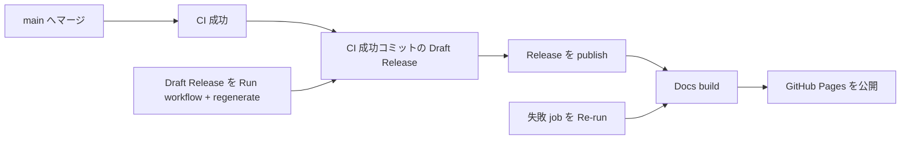

# Contributing

このリポジトリへの変更方法と、ローカル環境の構築・検証手順です。  
エンドユーザー向けの紹介・ダウンロード・インストールは [README.md](README.md) を参照してください。

## 開発環境

次のツールを用意してください。

- Git
- Python 3.10 以上（`pyproject.toml` の設定に合わせます）
- [uv](https://docs.astral.sh/uv/)
- Blender 5.2 / 4.5 / 4.2 LTS（バックグラウンド smoke test 用）
- GUI smoke test を実行する場合は Docker、Xvfb、ImageMagick

Blender は Windows では、例えば次の場所にインストールします。

```text
C:\Program Files\Blender Foundation\Blender 5.2\5.2\blender.exe
```

## 環境構築（Windows PowerShell）

リポジトリを取得します。

```powershell
git clone https://github.com/mushus/blender-addons.git
Set-Location .\blender-addons
```

プロジェクト環境を構築します。

```powershell
uv sync
uv pip install --python .venv\Scripts\python.exe -r requirements-dev.txt
```

uv のキャッシュにアクセスできない場合は、ユーザーの一時ディレクトリをキャッシュ先に指定します。

```powershell
$env:UV_CACHE_DIR = Join-Path $env:TEMP "blender-addons-uv-cache"
uv sync
uv pip install --python .venv\Scripts\python.exe -r requirements-dev.txt
```

`uv.lock` はコミット対象です。依存関係を変更した場合は `uv lock` を実行し、差分を確認してください。

## 検証

まず静的チェックを実行します。

```powershell
uv run ruff check .
uv run basedpyright
```

Blender のロックファイルと背景実行を確認します。

```powershell
uv lock --check
uv run python scripts\run_background_smokes.py `
  --blender "C:\Program Files\Blender Foundation\Blender 5.2\5.2\blender.exe"
```

ZIP 生成とレイアウト確認は次のコマンドです。

```powershell
uv run make-zip
uv run python scripts\check_zip_layout.py
```

CI と同じ一括検証は Docker を使用します。

```powershell
uv run run-docker --build --exec -- python ./scripts/run_ci.py
```

Blender のランタイムテストは、埋め込み Blender MCP セッションではなく、Blender の `--background` モードまたは Docker 内で実行してください。詳細は [`blender-addon-testing`](.agents/skills/blender-addon-testing/SKILL.md) を参照してください。

## 変更の流れ

- 実装後は静的チェック、ZIP 検証、Blender smoke test を通してから変更を提出します。
- アドオンのバージョンは `addons/<tool>/__init__.py` の `bl_info["version"]` を更新します。

## 新しいツールを追加する場合

1. `addons/<id>/addon.json` にパッケージ情報（`status` / `group_id` / `group_label` / `extension`）を追加する（グローバル設定は `pyproject.toml` の `[tool.blender-addons]`）
2. `addons/<id>/tests/smoke_test.py` に background smoke test を追加する
3. 必要に応じて `addons/<id>/tests/ui_smoke_test.py` を追加する
4. [`blender-addon-coding-rules`](.agents/skills/blender-addon-coding-rules/SKILL.md) と [`blender-addon-testing`](.agents/skills/blender-addon-testing/SKILL.md) の契約に従って、再読み込み時の後始末を実装する

## パッケージとリリース

- ZIP 生成: `uv run make-zip`（`scripts/make_zip.py`）
- リリース検証: `uv run prepare-release`（`scripts/prepare_release.py`）
- ツール版の正は `addons/<tool>/__init__.py` の `bl_info["version"]`



- 通常: CI 成功後に Draft が作られる。同日の Release が既に publish 済みなら翌日送り。
- リカバリ (Draft): Actions の **Draft Release** を `regenerate=true` で手動実行 → Release 削除 + タグを HEAD へ force-push + Draft 再作成 → 再度 publish。
- リカバリ (Docs): build / deploy が失敗した workflow run で **Re-run failed jobs** を実行する。成功表示なのにサイトが古い場合も、Actions の **Deploy Documentation Site to GitHub Pages** を `main` で Run workflow する（release イベントは tag SHA の重複で Pages が旧 artifact のまま成功扱いになることがある）。サイト本体は `main` から、ダウンロード情報は公開済み Release から生成される。

ダウンロード一覧と Extensions 用 `index.json` は `site` の Astro 起動時に、公開済み Release の manifest から生成する。Release を publish するまで、サイトのダウンロード URL / 拡張リポジトリ一覧は更新されない。

Extensions リポジトリ URL: `https://mushus.github.io/blender-addons/index.json`  
（個別アドオンのみ。Suite は載せない。初回 publish 後の Get Extensions 導入確認は手動でよい。）
