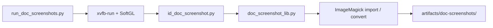

# ドキュメント用スクリーンショット

Docker + Xvfb 上でアドオン UI を撮影する。ホスト Windows の実ウィンドウには依存しない。

## 実行

```bash
uv run run-docker --build --exec -- python ./scripts/make_zip.py
uv run run-docker --exec -- python ./scripts/run_doc_screenshots.py
```

個別:

```bash
uv run run-docker --exec -- python ./scripts/run_doc_screenshots.py --only slide_relax
```

一覧:

```bash
uv run run-docker --exec -- python ./scripts/run_doc_screenshots.py --list
```

出力先（既定）: `artifacts/doc-screenshots/<package_id>/*.png`

サイト掲載時は PNG を `site/src/assets/addons/<package_id>/` にコピーし、各アドオン MDX から参照する。

## 構成



| 役割 | ファイル |
|------|----------|
| ランナー | `scripts/run_doc_screenshots.py` |
| 共有ヘルパ | `scripts/doc_screenshot_lib.py` |
| 個別エントリ | `scripts/<id>_doc_screenshot.py` |

契約: 個別エントリは `run_doc_shot(callback)` を使い、生成した PNG パスのリストを返す。失敗は例外で即時中断。結果は `doc_screenshot_result.txt`（`PASS` / `FAIL`）。

## SoftGL 制約

Blender のスクショ演算子は空バッファになりやすい。仮想ディスプレイ全体を `import` し、Blender region 座標で `convert -crop` する。

領域切り出し後、背景差分から中身行の帯を求め、上端の十分な高さの帯に合わせて縦余白を落とす（パディング 8px）。
VIEW_3D で SoftGL が下側にビューポートノイズを出す場合でも、上端バンドを優先する。

## 新しい撮影エントリ

1. `scripts/<id>_doc_screenshot.py` を追加
2. ZIP（`dist/<id>.zip`）を前提にアドオンを有効化
3. UI を docs 向け状態にして `capture_region(...)` する
4. Docker 上で `--only <id>` が通ることを確認
