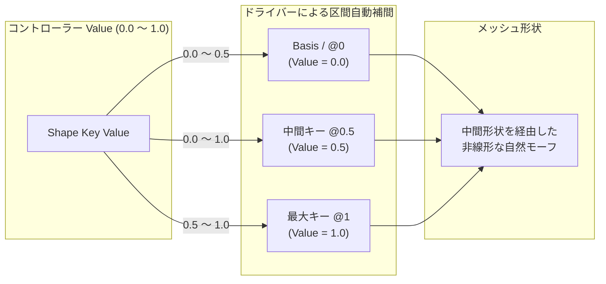
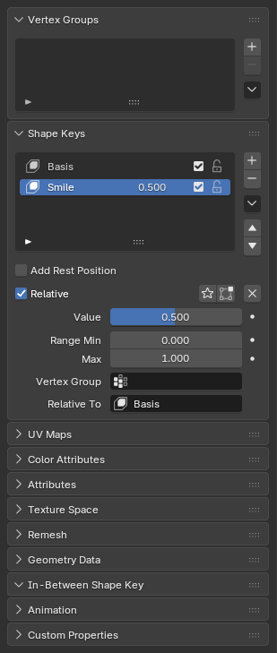

import { Badge } from '@astrojs/starlight/components';
import AddonDownloadLink from '../../../components/AddonDownloadLink.astro';

<Badge text="Blender 5.1+" /> <Badge text="Animation / Rigging" />

<AddonDownloadLink packageId="in_between_shape_key" />

## 概要

**In-Between Shape Key** は、キャラクターの表情作成やモーフターゲットアニメーションにおいて、複数のシェイプキーの中間状態（In-between）を自動補間・作成するツールです。

---

## UIの配置場所

プロパティエディタ > **オブジェクトデータプロパティ** (緑色の三角アイコン) > **シェイプキー (Shape Keys)** パネル内の特殊メニューに統合されます。

---

## 主な機能と使い方

1. 通常のシェイプキーを1つ選択し、**Convert to In-Between Shape Key** を実行します。元の形状は初期キー `@1` へ移されます。
2. コントローラーの **Value** を目的の位置へ設定し、Value右の下向きボタンから既存のシェイプキーを選択して追加します。選択したキーは `Controller@Value` に変更されます。
3. 各ターゲット行のスライダーをドラッグするか数値を入力して、キーの位置を `0.000`〜`1.000` の範囲で変更します。名前にも同じ位置を使用します（例: `Smile@0.5`）。`@.5` や `@0.500` は無効です。ドラッグ中は表示だけを更新し、操作が止まると名前とドライバーへ反映します。`@0` はValueが0のときに適用されます。最大位置のキー以降は100%まで同じ形状を維持します。

`@1` は必須ではありません。FBX出力時は最大位置の形状を位置1にも複製し、FBXの100%まで最後の形状を維持する区間を作成します。

変換後のコントローラーとターゲットのShape Key Valueはドライバー制御され、紫色で表示されます。値の操作とキーフレーム設定はIn-BetweenパネルのValueで行います。

所属するターゲットは位置順に表示されます。Blender標準のシェイプキー一覧での並び順は所属に影響しません。左端のキーアイコンで対象を選択し、右端の×ボタンで削除できます。

### 主なオペレーター

| オペレーター                        | 説明                                               |
| :---------------------------------- | :------------------------------------------------- |
| **Convert to In-Between Shape Key** | 通常のシェイプキーをIn-Betweenコントローラーへ変換 |
| **Add to In-Between**               | 既存のシェイプキーをダイアログで指定して追加       |
