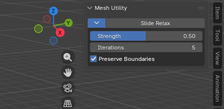

import { Badge } from '@astrojs/starlight/components';
import AddonDownloadLink from '../../../components/AddonDownloadLink.astro';

<Badge text="Blender 4.2+" /> <Badge text="Mesh Tool" />

<AddonDownloadLink packageId="slide_relax" />

## 概要

**Slide Relax** は、編集モードにおいて指定した頂点群の密度・配置を滑らかに緩和（リラックス）するアドオンです。
ハイポリメッシュのトポロジー調整や、有機的モデルの表面のスムージング作業を高速化します。

---

## UIの配置場所

3D ビューポート > 編集モード (Edit Mode) > サイドバー (`N` キー) 内の `Edit` タブに配置されます。

---

## 主な機能と使い方

1. 編集モードでリラックスさせたい頂点（またはエッジ/面）を選択します。
2. サイドバーの **Slide Relax** ボタンをクリックします。
3. Strength / Iterations / Preserve Boundaries で強度と境界の扱いを調整します。

### 主なパラメータ

| パラメータ              | 説明                                             |
| :---------------------- | :----------------------------------------------- |
| **Strength**            | 1 回あたりの接線方向への緩和量（0.0 〜 1.0）     |
| **Iterations**          | リラックス処理の繰り返し回数                     |
| **Preserve Boundaries** | 境界頂点の内向き移動を抑え、輪郭の収縮を防ぎます |
