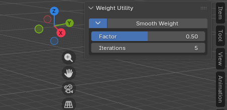

import { Badge } from '@astrojs/starlight/components';
import AddonDownloadLink from '../../../components/AddonDownloadLink.astro';

<Badge text="Blender 5.1+" /> <Badge text="Paint Tool" />

<AddonDownloadLink packageId="weight_smooth" />

## 概要

**Smooth Weight** は、Weight Paint の選択頂点に対して、表示中の 1 頂点グループだけでなく、アーマチュアの全変形ボーンウェイトをまとめてスムーズし、Normalize するアドオンです。

---

## UIの配置場所

3D ビューポート > ウェイトペイント (Weight Paint) > サイドバー (`N` キー) 内の `Edit` タブ（Weight Utility）。

---

## 主な機能と使い方

1. メッシュに Armature Modifier（または Armature 親）があることを確認します。
2. Weight Paint に切り替えます。
3. サイドバーの **Smooth Weight** を実行します。
   - 頂点選択マスクがオフのときは、先にオンにして終了します。頂点を選んで再度実行してください。
4. 頂点を選択した状態で再度実行すると、スムーズと Normalize が行われます。

### 主なパラメータ

| パラメータ | 説明 |
| :--- | :--- |
| **Factor** | 1 回あたり近傍平均へ寄せる量（0.0 〜 1.0） |
| **Iterations** | スムーズ処理の繰り返し回数 |

### 変更されないもの

- 未選択頂点のウェイト
- ロック済み頂点グループ
- ボーン変形以外の頂点グループ
