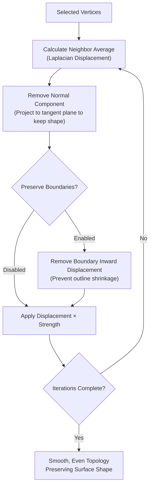

import { Badge } from '@astrojs/starlight/components';
import AddonDownloadLink from '../../../../components/AddonDownloadLink.astro';

<Badge text="Blender 4.0+" /> <Badge text="Mesh Tool" />

<AddonDownloadLink packageId="slide_relax" lang="en" />

## Overview

**Slide Relax** is a mesh editing tool that smoothly relaxes and evens out vertex spacing while retaining the overall surface volume and shape during Edit Mode. Excellent for retopology and organic modeling.

---

## UI Location

- 3D Viewport > Edit Mode > Sidebar (`N` key) under the `Edit` tab.

---

## Features & Usage

1. Select vertices, edges, or faces in Edit Mode.
2. Click **Slide Relax** in the Sidebar panel.
3. Adjust Strength, Iterations, and Preserve Boundaries as needed.

### Parameters

| Parameter               | Description                                                       |
| :---------------------- | :---------------------------------------------------------------- |
| **Strength**            | Tangential relaxation amount per pass (0.0 to 1.0)                |
| **Iterations**          | Number of relaxation passes                                       |
| **Preserve Boundaries** | Blocks inward motion on boundary vertices to avoid outline shrink |
