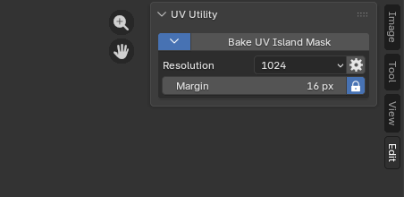

import { Badge } from '@astrojs/starlight/components';
import AddonDownloadLink from '../../../../components/AddonDownloadLink.astro';

<Badge text="Blender 4.0+" /> <Badge text="UV / Texture Paint" />

<AddonDownloadLink packageId="uv_island_mask" lang="en" />

## Overview

**UV Island Mask** allows 3D artists to generate mesh selection masks and vertex group masks based on UV island topology with a single click. Ideal for texture painting and material isolation.

---

## UI Location

- **UV Editor** > Select Menu
- 3D Viewport > **Texture Paint Mode** > Sidebar (`N` key)

---

## Features & Usage

1. Select elements belonging to target UV islands in UV or Edit mode.
2. Run **Mask by UV Island** to expand selection across entire UV islands.

### Key Highlights

- Single-click detection of complex UV seam boundaries
- Automatic assignment of vertex group mask regions
