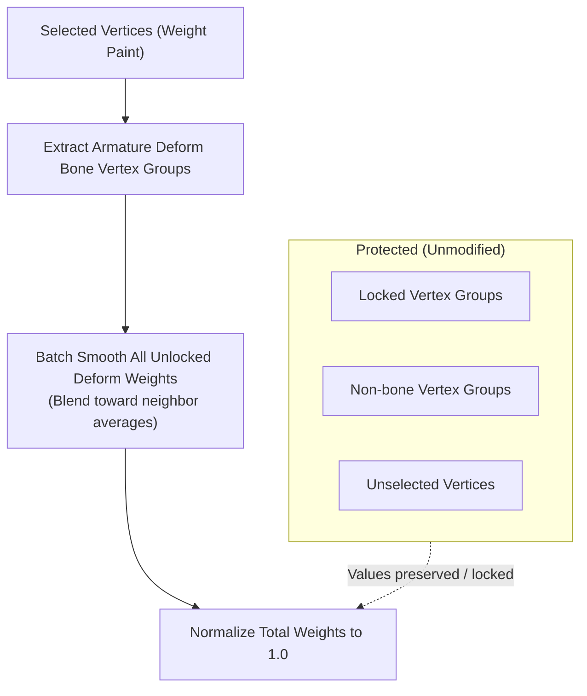

import { Badge } from '@astrojs/starlight/components';
import AddonDownloadLink from '../../../../components/AddonDownloadLink.astro';

<Badge text="Blender 5.1+" /> <Badge text="Paint Tool" />

<AddonDownloadLink packageId="weight_smooth_all" lang="en" />

## Overview

**Smooth Weight** smooths every unlocked armature deform weight on selected Weight Paint vertices, then normalizes them. Unlike Blender’s built-in smooth, it is not limited to the active (displayed) vertex group.

---

## UI Location

- 3D Viewport > Weight Paint > Sidebar (`N` key) under the `Edit` tab (Weight Utility).

---

## Features & Usage

1. Ensure the mesh has an Armature Modifier (or an Armature parent).
2. Switch to Weight Paint mode.
3. Run **Smooth Weight** from the Sidebar.
   - If vertex selection is off, the first click turns it on and stops. Select vertices, then run again.
4. With vertices selected, run again to smooth and normalize.

### Parameters

| Parameter      | Description                                                  |
| :------------- | :----------------------------------------------------------- |
| **Factor**     | Blend amount toward neighbor averages each pass (0.0 to 1.0) |
| **Iterations** | Number of smoothing passes                                   |

### Left unchanged

- Weights on unselected vertices
- Locked vertex groups
- Non-bone deform vertex groups
